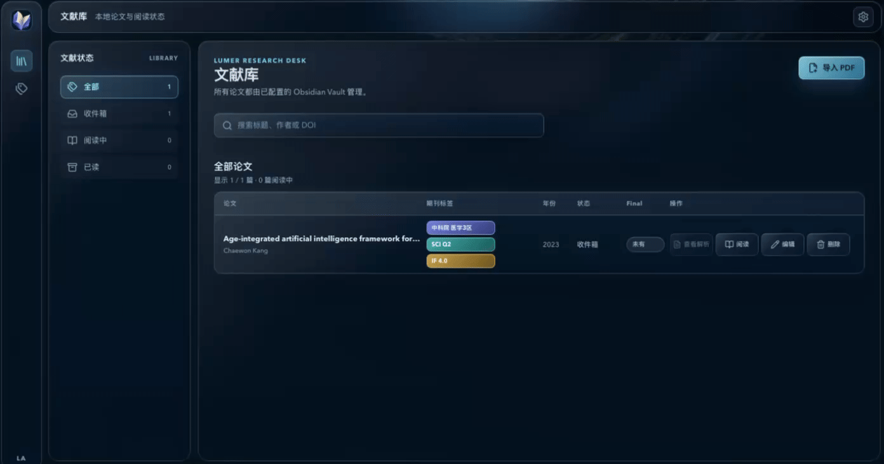
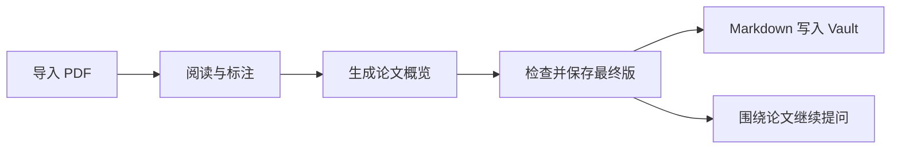

<div align="center">

# Lumer

### 把论文读明白，也把灵感留下来。

一个面向论文阅读、理解与知识沉淀的 AI-native Research Workspace。

<br />

[](#快速开始)
[](#快速开始)
[](#项目状态)
[](LICENSE)

<br />

[快速开始](#快速开始) · [使用与开发说明](./app/README.md)

</div>

<br />

<!-- 产品主视觉 -->
<p align="center">
 
</p>

---

## Lumer 是什么？

Lumer 是一个面向有持续文献阅读需求的科研工作者、研究生和知识工作者的 AI-native Research Workspace。

它不只是把论文交给 AI 总结，而是尽可能保留 **原文、证据、理解与笔记之间的联系**。

```text
论文 → Evidence → 理解 → 知识
```

> 阅读一篇论文，不应该结束在关闭 PDF 的那一刻。

---

## 为什么是 Lumer？
科研工作者都有一段投入时间长且枯燥的任务：文献整理和调研。面对繁杂的文献，实在难以分类阅读并整理。
你是否也有这样的日常？
PDF 越存越多，过一阵再打开，已经想不起为什么当时要留它；
每读一篇都要重新拖进 GPT、重新交代背景、重新写 Prompt；
AI 回答看起来头头是道，却还得自己翻回原文确认，结果发现货不对板；
论文在阅读器里，问答在 GPT 里，笔记散在 Markdown 和 Word 里，每天打开无数个重复页面，梳理已经浪费了大量时间，然后结束了一天的科研工作。

读论文已经够累了（读研更累），别再把时间花在找、传、问、查、搬上。
**没关系，Lumer帮你解决。**

Lumer连通了整个阅读链路高度碎片化，集成了文献管理、阅读、高亮标记、ai文献阅读和提问以及整理好你的思路到Obsidian。从此阅文不丢，节省了科研工作大部分的无效时间。
对于文献分析得到答案的过程，Lumer设计了多层证据追溯，从而最大化确保文献分析有理可据，可在pdf中找到对应段落。
让ai走进阅读工作流，Lumer做的就是这样一件事。

### 论文放在一起，阅读进度留得住

导入 PDF，补充标题、作者等元数据，用标签和阅读状态整理文献。下次回来，可以从文献库找到论文，接着查看标注和对话记录。

### 边读边标，回到原文核对

在阅读器中选择文字、高亮、添加批注。标注写入 Lumer 托管的 PDF 副本，导入前的源文件保持原样。

### 接自己的 AI，把论文上下文带进对话

连接本机已登录的 Codex CLI、Claude Code 或者配置自己的 OpenAI-compatible API。先生成论文概览，检查并保存为最终版卡片，再围绕这篇论文提问。Lumer 会带上正文和当前卡片，减少反复上传 PDF、交代背景的步骤。

### 论文卡片直接写进 Obsidian

点击“同步到 Obsidian”，把确认后的概览保存为 Final，并将 Markdown 卡片写入自己的 Vault。普通本地目录也能使用。PDF、分析记录和对话保存在本地，后续重新生成时保留历史版本。

---

## 从导入到继续提问



卡片保留你确认的版本，对话围绕同一篇论文继续。若在 Obsidian 中修改过卡片，后续同步遇到内容冲突时，Lumer 会提示你处理。

## 引文核验做到了哪一步

Lumer 按页提取 PDF 正文，保存页码信息。结构化 Paper Card 的 Evidence 验证会检查引文能否在当前论文的对应页定位，未通过验证的卡片不能提交为 Final。

日常入口生成的概览可以经你确认后直接保存为 Final。它没有经过上述逐条引文核验；即使引文定位成功，结论是否得到原文支持，也需要你判断。

目前支持可提取文字的 PDF。纯扫描件需要先在其他工具中完成 OCR；Lumer 尚未提供 OCR 或表格结构化解析。

---

## 快速开始

先安装 Node.js 20.9.0+（含 npm）和 Python 3.10+。

### macOS

在项目根目录执行这一条命令，完成安装和构建：

```bash
cd app && python3 -m venv .venv && .venv/bin/python -m pip install -r python/requirements.txt && npm ci && npm run build
```

成功后，在当前 `app/` 目录启动：

```bash
npm run start
```

打开 <http://127.0.0.1:3000>。

也可以先用 `Ctrl+C` 停止终端中的服务，再双击项目根目录的 `Lumer Assistant.app`。它需要与 `app/` 文件夹放在一起，首次使用前仍需完成上面的安装步骤。

### Windows

在项目根目录打开 PowerShell，依次执行；每一步成功后再执行下一步：

```powershell
cd app
py -3 -m venv .venv
.\.venv\Scripts\python.exe -m pip install -r python/requirements.txt
npm ci
npm run build
npm run start
```

打开 <http://127.0.0.1:3000>。如果系统没有 `py` 命令，可将第二行换成 `python -m venv .venv`，并确认该 Python 为 3.10+。

Windows 使用命令行启动；上述步骤尚未完成 Windows 整机验收。

### 第一次打开

1. 在 **Settings** 中填写一个已存在、可读写目录的绝对路径作为 Vault，验证并保存。可以使用已有 Obsidian Vault，也可以使用普通文件夹。
2. 连接已在本机登录的 **Codex CLI**，或填写自己的 **OpenAI-compatible API** 配置；刷新状态，选择默认 Provider 并保存设置。
3. 回到文献库导入 PDF，阅读、标注并生成概览。检查概览后点击“同步到 Obsidian”，保存为 Final，再围绕论文继续提问。

详细配置、数据目录和常见问题见 [使用与开发说明](./app/README.md)。

---

## 架构与技术栈

Lumer 在本机运行 Next.js 服务。浏览器负责阅读和交互，服务端调用 Python 处理 PDF、连接 AI Provider，并将数据写入 Vault。

| 部分 | 实现 |
| --- | --- |
| 界面 | Next.js、React、Tailwind CSS |
| 本地 API | Next.js Route Handlers，运行于 Node.js |
| PDF 阅读 | react-pdf / PDF.js |
| 正文提取与标注写入 | Python / PyMuPDF |
| 卡片展示 | React Markdown、KaTeX |
| 存储与导出 | 本地 PDF、JSON 和 Markdown，可写入 Obsidian Vault |

数据目录、模块职责和开发命令见 [使用与开发说明](./app/README.md#架构与目录)。

---

## 项目状态

Lumer 当前是 MVP，欢迎大家提意见！将持续修改和优化

**v0.2** 优化论文库管理体验
优化论文搜索、标签筛选、阅读状态和排序功能，帮助用户更快定位和整理已导入的论文，减少重复查找与管理成本。

**v0.3** 快速配置自有 API
支持用户在 Settings 中快速配置 OpenAI-compatible API，并在codex、cc、API间快速切换。（省去了找config的苦）

**v0.4** 优化生成解析内容
简化解析内容，保留必须项和确定结论，方便提取md文件做整理，不再翻页痛苦。

**正在改进中** **v0.5**  自动读取doi、作者、年份等功能


---

## 参与贡献

欢迎提交 Issue 或 Pull Request。报告问题时，请附上系统版本、Node/Python 版本、复现步骤和错误信息。


---
## License

This project is licensed under the [MIT License](LICENSE).
